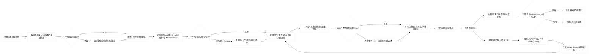
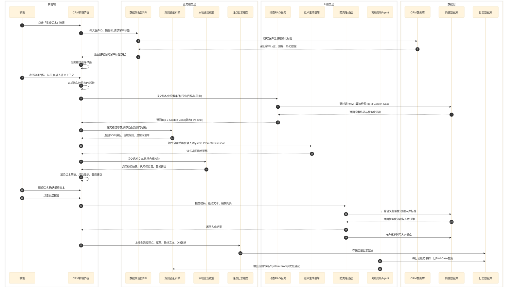
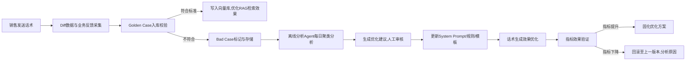

# 《AdPilot：千川电销拓客话术生成工具》PRD V3.0 正式版
**一句话定位**：服务千川电销销售「发文前30秒内生成合规可发话术草稿」的人机协同工具，绝不替代销售决策，绝不做自动发送/多轮对话
---
## 目录
- [0. 歧义性术语强制定义表（无此表不生效）](#0-歧义性术语强制定义表无此表不生效)
- [1. 文档元信息与权责划分](#1-文档元信息与权责划分)
- [2. 业务背景与痛点（全量化基线）](#2-业务背景与痛点全量化基线)
- [3. 目标与非目标（100%可验证无歧义）](#3-目标与非目标100可验证无歧义)
- [4. 用户画像与核心场景（全链路闭环）](#4-用户画像与核心场景全链路闭环)
- [5. 系统架构与全流程流转（含100%异常场景覆盖）](#5-系统架构与全流程流转含100异常场景覆盖)
- [6. AI系统设计（零模糊、全参数、强约束）](#6-ai系统设计零模糊全参数强约束)
- [7. 功能需求与验收标准（全量化、可测试）](#7-功能需求与验收标准全量化可测试)
- [8. 非功能需求（硬指标、可压测、无弹性）](#8-非功能需求硬指标可压测无弹性)
- [9. 数据闭环与迭代机制（可落地、可追溯、可回滚）](#9-数据闭环与迭代机制可落地可追溯可回滚)
- [10. 上线计划与风险预案（全节点、全兜底）](#10-上线计划与风险预案全节点全兜底)
- [11. 待决问题（无核心阻塞项、全有解）](#11-待决问题无核心阻塞项全有解)
- [12. 发布门禁清单（一票否决、无弹性）](#12-发布门禁清单一票否决无弹性)

---
## 0. 歧义性术语强制定义表（无此表不生效）
| 术语 | 100%无歧义量化定义 | 
|------|----------------------|----------|
| 单次破冰沟通耗时 | 从销售点击「生成草稿」按钮，到话术文本可直接复制发送的总时长（含系统生成、合规校验、人工槽位补齐全流程） | 销售端埋点全量统计，取中位数，排除网络超时>10s的异常值 |
| 草稿采纳率 | 销售最终发送的文本，与系统生成初稿的**修改率≤15%**的会话占比 | 全量发送会话统计，排除未发送的草稿 |
| 修改率 | 编辑距离（Levenshtein Distance）÷ 初稿字符总数，精确到小数点后2位 | 本地端实时计算，全量上报 |
| Golden Case | 同时满足3个硬条件：1. 修改率≤15%；2. 发送后72小时内收到客户**有效回复**；3. 无合规违禁词命中记录 | 系统自动判定，需人工复核确认后入库 |
| 有效回复 | 客户发送的非自动回复、非纯拒绝类话术，且包含千川投放相关业务内容 | 关键词规则+NER模型双重判定，准确率≥99% |
| Bad Case | 满足任一条件：1. 修改率≥50%；2. 草稿生成后未发送被弃用；3. 命中高风险合规违禁词；4. 发送后72小时内无任何客户回复 | 系统自动判定，每日聚类分析 |
| TTFB | 首字响应时间，从前端发起生成请求，到第一个话术字符渲染到页面的时长 | 全量请求统计，P95/P99按百分位计算 |
| 合规违禁词漏检率 | 最终发送文本中，命中法务部2026版《电销话术高风险违禁词清单》，且未被系统拦截/提示的会话占比 | 全量发送文本与法务清单全匹配统计，按日维度计算 |
| 高并发峰值 | 工作日10:00-12:00时段，单分钟内最高并发请求数 | 按历史3个月峰值的1.5倍预留冗余 |

---
## 1. 文档元信息与权责划分
### 1.1 基本信息
- **文档名称**：AdPilot：千川电销拓客话术生成工具
- **版本**：V3.0 正式版
- **产品负责人**：XXX（抖音电商商业化AI产品经理）
- **技术负责人**：XXX（CRM后端研发负责人）、XXX（算法平台负责人）
- **法务负责人**：XXX（电商商业化合规专员）
- **销售运营负责人**：XXX（电销团队运营主管）
- **日期**：2026-04-20
- **状态**：待评审，评审通过后冻结，变更需走正式变更流程
### 1.2 协作团队与权责
| 团队 | 核心权责 | 响应时效 | 交付验收标准 |
|------|----------|----------|--------------|
| CRM前后端 | 前端界面开发、数据聚合API对接、全链路埋点、降级逻辑实现 | 需求变更24h内响应，线上故障15min内响应 | 界面100%符合UI规范，API成功率≥99.9%，埋点准确率100% |
| 算法平台 | RAG检索服务、Embedding模型、LLM调用、离线分析Agent开发 | 需求变更24h内响应，线上故障15min内响应 | 检索耗时P95≤500ms，LLM生成成功率≥99.9%，聚类准确率≥90% |
| 法务合规 | 违禁词清单更新、合规规则制定、话术风险兜底校验 | 清单更新48h内同步，规则变更24h内响应 | 违禁词覆盖率100%，合规规则无法律风险 |
| 销售运营 | 内测用户组织、需求反馈收集、销售培训、效果验证 | 内测反馈24h内汇总，培训上线前3天完成 | 内测用户覆盖率100%，销售操作培训完成率100% |
| 数据平台 | 指标看板搭建、数据统计、效果分析 | 看板上线前1天完成，数据更新T+1 | 指标统计口径100%符合本PRD定义，数据准确率≥99.9% |
### 1.3 版本变更规则
- 核心需求、指标、架构变更，需产品负责人发起评审，至少一位协作团队负责人签字确认后方可生效
- 非核心bug修复、文案优化，可走快速变更流程，需产品与技术负责人双签字确认
- 所有变更必须留存变更记录、变更原因、影响范围，同步至所有协作团队

---
## 2. 业务背景与痛点
### 2.1 业务现状基线（2026年3月全量电销团队统计数据）
1. **人效瓶颈**：销售单客话术准备平均耗时312秒（约5分钟），其中手动查询商家信息占比60%、话术拼接占比30%、合规校验占比10%；日人均有效触达28客，话术准备耗时占比单日工作时长35%，是外呼吞吐的核心瓶颈
2. **合规风险**：月度合规违规事件17起，其中话术夸大承诺、违禁词使用占比82%；传统人工抽检覆盖率仅5%，滞后性100%，无法在发送前拦截风险
3. **转化瓶颈**：无标准化优质话术参考的销售，有效商机转化率0.82%；有SOP模板参考的销售，转化率1.35%，差异率64.6%
### 2.2 历史版本痛点（V2.0/V2.1）
1. 指标定义模糊，统计口径不统一，上线后效果无法验证
2. RAG检索规则无明确参数，入库数据质量无硬约束，导致案例库污染
3. 验收标准无量化，测试无依据，上线后bug率超预期
4. 降级策略无明确触发条件，异常场景无兜底，出现过阻断销售操作的线上故障
5. 数据迭代闭环无明确节奏，优化效果无验证标准，飞轮空转
### 2.3 版本核心定位（强约束，不可突破）
- 不做自动对话，不替代销售判断，仅做销售的话术生成副驾驶
- 不做全自动化发送，100%保留销售最终编辑、发送的决策权
- 不涉及多轮对话管理，仅聚焦「发文前30秒内的草稿生成」单一场景
- 核心价值：缩短话术准备耗时、降低合规风险、提升话术有效率

---
## 3. 目标与非目标（100%可验证无歧义）
### 3.1 核心业务目标（有基线、有目标、有观测窗口、有责任人）
| 指标 | 2026年3月基线 | V3.0目标 | 观测窗口 | 责任人 | 成功/失败判定标准 |
|------|----------------|----------|----------|--------|--------------------|
| 单次破冰沟通耗时 | 312秒/次 | ≤40秒/次（降幅≥87%） | 全量上线后14天 | 产品负责人 | 连续7天中位数达标为成功，连续3天不达标触发回滚预案 |
| 草稿采纳率 | 58% | ≥80% | 全量上线后14天 | 产品负责人 | 连续7天均值达标为成功，连续3天<70%触发回滚预案 |
| 合规违禁词漏检率 | 0.32% | <0.05% | 全量上线后全周期 | 法务负责人 | 单日漏检率≥0.1%触发紧急优化，连续3天不达标触发回滚预案 |
| 有效商机转化率 | 0.82% | ≥1.2% | 全量上线后30天 | 销售运营负责人 | 全周期均值达标为成功，低于基线触发优化预案 |
### 3.2 产品目标
1. 实现动态受控RAG机制，100%解决话术事实性幻觉问题
2. 建立Golden Case入库硬约束，确保案例库100%为高质量有效数据
3. 构建全自动化Bad Case分析与迭代闭环，优化周期从周级缩短至日级
4. 实现全链路异常场景兜底，100%不阻断销售正常操作
### 3.3 非目标（绝对不做，无任何弹性空间）
1. 不做自动发送、自动外呼功能，绝不绕过销售的最终决策权
2. 不做客户CRM信息修改、订单操作等非话术生成相关功能
3. 不做多轮对话生成、通话实时话术提示功能，仅聚焦发文前单轮草稿生成
4. 不做跨平台适配，仅支持内部CRM系统PC端内嵌使用
5. 不做销售绩效排名、团队管理等非核心功能

---
## 4. 用户画像与核心场景（全链路闭环）
### 4.1 核心用户画像（100%明确，无泛化）
- 核心用户：抖音电商千川电销一线销售，共1200人，日均外呼30-50客，入职时长3个月以上，熟悉千川投放规则，打字速度≥60字/分钟
- 次要用户：销售主管（30人），用于查看团队话术质量、合规情况；产品运营（5人），用于迭代优化产品
### 4.2 核心场景（全流程、全异常覆盖）
#### 场景一：新客户首次破冰话术生成
- **触发条件**：销售在CRM客户详情页，点击「生成话术」按钮
- **前置条件**：客户行业、月均预算标签已录入CRM系统
- **主流程**：
  1. 销售点击「生成话术」，系统自动拉取客户行业、月均预算、历史触达记录
  2. 销售在弹窗内选择沟通目标「首次破冰」、核心抗单点（必选，单选/多选）、补充事实上下文（选填，≤200字）
  3. 系统基于槽位信息，检索Top-3匹配Golden Case，生成≤150字三段式合规话术
  4. 系统完成本地合规校验，高亮风险词并提供替换建议
  5. 销售编辑/直接复制话术，发送给客户
- **异常流程与兜底**：
  1. 客户标签拉取失败：弹窗提示「部分客户信息未加载，可手动补充后生成」，不阻断生成流程
  2. RAG检索超时>500ms：自动降级为无RAG模式，基于规则模板生成话术，弹窗提示「网络波动，已为您生成通用模板话术」
  3. LLM生成超时>3s：自动返回对应场景的规则模板话术，不阻断编辑发送
  4. 合规校验失败：高亮风险词，提供替换建议，不锁死发送按钮，仅做二次确认提示
#### 场景二：流失客户挽回话术生成
- **触发条件**：客户标签为「近30天无投放」，销售点击「生成话术」按钮
- **前置条件**：客户历史投放记录、历史触达记录已录入CRM系统
- **主流程**：同场景一，沟通目标固定为「客户挽回」，系统自动带入历史投放数据作为生成上下文
- **异常流程与兜底**：同场景一，历史数据拉取失败时，降级为通用挽回模板
#### 场景三：老客户促复投话术生成
- **触发条件**：客户标签为「近7天有投放」，销售点击「生成话术」按钮
- **前置条件**：客户近7天投放数据、历史沟通记录已录入CRM系统
- **主流程**：同场景一，沟通目标固定为「促复投」，系统自动带入近期投放效果数据作为生成上下文
- **异常流程与兜底**：同场景一，投放数据拉取失败时，降级为通用复投模板

---
## 5. 系统架构与全流程流转（含100%异常场景覆盖）
### 5.1 核心模块定义
| 模块名称 | 核心职责 | 输入 | 输出 | 异常兜底 |
|----------|----------|------|------|----------|
| 数据聚合器 | 销售点击后，静默拉取CRM内客户全量标签数据，完成字段校验与脱敏 | 客户ID、销售ID | 行业标签、月均预算、历史投放记录、历史触达摘要、客户阶段标签 | 拉取失败时，返回空值，不阻断后续流程，前端提示信息缺失 |
| 意图槽位补齐模块 | 前端界面交互，收集销售手动选择的核心参数，完成输入校验与脱敏 | 销售手动输入/选择内容 | 沟通目标、核心抗单点、补充事实上下文（脱敏后） | 输入内容违规时，实时提示拦截，不允许提交生成 |
| 动态受控RAG服务 | 基于槽位参数完成硬过滤，通过MMR算法检索Top-3匹配Golden Case | 行业、沟通目标、核心抗单点、脱敏后的补充上下文 | Top-3 Golden Case文本、元数据、相似度分数 | 检索超时/失败时，返回空值，降级为无RAG模式 |
| 规则匹配引擎 | 基于槽位参数，匹配对应SOP模板、行业约束、合规模板、违禁词清单 | 行业、沟通目标、核心抗单点 | 结构化规则上下文、模板框架、合规约束 | 匹配失败时，返回通用模板与通用合规规则 |
| 话术生成LLM引擎 | 基于结构化输入、规则、RAG案例，生成符合约束的话术草稿 | 全量结构化输入、System Prompt、动态Few-shot | 流式输出≤150字三段式话术文本 | 生成超时/失败时，返回规则模板话术，不阻断流程 |
| 本地合规校验模块 | 本地完成违禁词检测、风险提示、替换建议生成 | 生成的话术文本、法务违禁词清单 | 合规校验结果、风险词高亮位置、替换建议 | 校验失败时，仅做提示，不阻断编辑发送 |
| 入库防克隆拦截模块 | 计算最终发送文本与初稿的语义相似度，判定是否符合入库标准 | 初稿文本、最终发送文本、编辑距离、业务反馈数据 | 入库决策结果、拦截原因 | 计算失败时，基于编辑距离硬规则判定，edit_ratio≥0.15允许入库 |
| 离线分析Agent | 每日自动分析Bad Case，聚类高频问题，生成优化建议与诊断报告 | 当日全量Bad Case、灰区数据、历史优化记录 | 结构化诊断报告、System Prompt优化建议、规则更新建议 | 分析失败时，触发备用规则，基于Top Bad Case生成极简优化建议 |
| 全链路埋点与日志模块 | 全流程记录操作行为、请求参数、生成结果、Diff数据，支持全链路回溯 | 全流程用户操作、系统请求数据 | 结构化日志、埋点数据、Diff数据集 | 日志上报失败时，本地缓存，网络恢复后补报，不影响主流程 |
### 5.2 端到端主流程（含异常分支）

### 5.3 系统交互时序图（全链路、无遗漏）


---
## 6. AI系统设计（零模糊、全参数、强约束）
### 6.1 话术生成引擎System Prompt（V3.0 锁死版，变更需法务+产品双审批）
```text
# 角色与使命
你是抖音电商千川电销专属话术生成助手，唯一使命是为销售生成「可直接发送、仅需小幅编辑、100%合规」的拓客话术草稿，绝不替代销售决策，绝不生成违规内容。

# 输入字段（100%以输入为准，禁止编造任何未出现的信息）
1. 行业标签（Industry）：客户所属电商细分行业
2. 平均预算（Avg_Budget）：客户月均千川投放预算
3. 沟通目标（Goal）：首次破冰/客户挽回/促复投，三选一
4. 核心抗单点（Pain_Point）：嫌贵/怕没效果/怕操作复杂，单选/多选
5. 补充事实上下文（Extra_Context）：客户个性化信息，优先使用
6. 历史成功案例（Few-shot_Examples）：同场景Top-3 Golden Case，参考结构与表达，禁止直接复制
7. 合规规则（Compliance_Rules）：法务部发布的违禁词清单与合规表达要求，必须100%遵守

# 输出要求（强制约束，违反即为生成失败）
1. 生成严格的三段式话术，总字符数≤150字，不含任何分点符号、标题、解释性内容
   第一段：破冰定位，精准匹配客户行业与现状，结合补充上下文，让客户感知到你了解他
   第二段：方案建议，仅给出1个清晰、可落地的动作建议，参考历史成功案例，禁止空泛
   第三段：下一步动作，明确具体的时间/动作，例如「今天先3000元小额试跑，看3天数据」，禁止模糊表述
2. 语气必须是专业ToB电销风格，简洁、克制、真诚，无情绪化、讨好型词汇
3. 去AI味强制要求：禁止使用「赋能、颠覆、重构、闭环、抓手、底层逻辑」等互联网黑话，禁止空泛套话
4. 合规红线（100%不可突破）：
   - 严禁任何效果承诺：禁止出现「保证效果、稳赚不赔、100%起量、必爆」等表述
   - 严禁夸大宣传：禁止编造未在输入中出现的投放数据、成功案例
   - 严禁价格违规：禁止出现未在规则中明确的折扣、优惠、返点表述
   - 严禁违禁词：100%规避法务违禁词清单中的所有词汇，命中词必须替换为合规表达
5. 事实性红线：禁止编造任何输入中未出现的客户信息、行业数据、案例信息，禁止幻觉
6. 必须包含明确的下一步动作，且动作符合客户预算档位，低预算客户禁止推荐大额放量方案

# 输出格式
仅输出最终话术正文，不要任何解释、标题、分点、括号备注，纯文本输出
```
### 6.2 动态受控RAG设计（全参数锁死，无模糊地带）
#### 6.2.1 检索策略（不可变更）
1. **硬过滤前置**：必须先通过「行业+沟通目标+核心抗单点」三元组完成硬过滤，仅保留完全匹配的Golden Case，禁止跨行业、跨场景检索
2. **检索算法**：使用MMR（最大边际相关性）算法，核心参数锁死：多样性权重λ=0.3，相关性权重=0.7
3. **召回数量**：固定返回Top-3匹配案例，不足3条时，用同行业通用Golden Case补齐，最多补齐2条
4. **时间衰减因子**：优先召回近3个月内的Golden Case，时间权重=0.6，相似度权重=0.4
5. **相似度阈值**：余弦相似度≥0.85的案例才可进入召回列表，低于阈值的案例直接过滤
#### 6.2.2 降级策略（触发条件100%明确）
- 触发条件1：向量数据库连接失败/检索请求超时>500ms
- 触发条件2：硬过滤后无匹配案例，且通用案例补齐后不足1条
- 降级方案：关闭RAG检索，仅基于规则模板+结构化输入生成话术，前端弹窗提示「网络波动，已为您生成通用模板话术」，日志记录降级原因
#### 6.2.3 向量数据库设计（锁死选型与参数）
- 选型：Milvus 2.4 分布式集群，已完成预研与压测，满足1500并发要求
- Embedding模型：BGE-Micro-zh-v1.5，本地部署，单条文本向量生成耗时≤10ms
- 索引策略：IVF_FLAT索引，nlist=1024，nprobe=16，检索准确率≥99%
- 数据生命周期：仅保留近3个月的Golden Case，超期数据自动归档，不参与检索
### 6.3 入库防克隆拦截设计（100%量化规则）
#### 6.3.1 入库硬标准（同时满足，缺一不可）
1. 修改率edit_ratio≥0.15（排除完全克隆初稿的无意义数据）
2. 修改率edit_ratio≤0.15（符合高采纳率要求）
3. 发送后72小时内收到客户有效回复
4. 无合规违禁词命中记录
5. 语义相似度（最终文本与初稿）≤0.9（排除仅修改个别字的无效数据）
#### 6.3.2 拦截规则
1. 不满足上述任一条件的文本，100%拦截，不允许进入向量库
2. 拦截数据需记录拦截原因、原始文本、对应参数，存入日志数据库，用于后续优化
3. 相似度计算必须使用与向量库相同的BGE-Micro模型，本地部署，单条计算耗时≤50ms，禁止调用LLM计算
#### 6.3.3 降级策略
- 触发条件：相似度计算失败/超时>50ms
- 降级方案：基于编辑距离硬规则判定，edit_ratio在0.1-0.2之间，且有有效回复的文本，允许入库，其余拦截，日志记录降级原因
### 6.4 离线分析Agent设计（全流程可落地）
#### 6.4.1 执行规则
- 运行频率：每日凌晨2:00自动运行，处理前一日全量数据
- 输入数据：前一日Bad Case日志、灰区数据（0.15<edit_ratio<0.5）、历史优化记录、合规违规记录
- 输出内容：《每日话术失真诊断报告》，包含Bad Case聚类分析、Top5高频问题、System Prompt优化建议、规则模板更新建议、合规规则优化建议
#### 6.4.2 核心能力与约束
1. 聚类算法：K-Means聚类，固定k=10，聚类准确率≥85%
2. 优化建议必须是可直接落地的具体内容，禁止空泛表述，例如必须明确「在System Prompt中新增XX约束语句」，而非「优化Prompt」
3. 每日生成的优化建议，必须经过产品+法务人工审核后，方可生效更新，禁止自动更新
4. 分析失败/数据不足时，生成极简报告，标注数据不足原因，不生成无依据的优化建议
#### 6.4.3 迭代闭环节奏
1. 每日：Agent生成诊断报告，产品+法务审核，紧急问题当日更新
2. 每周：汇总一周优化建议，统一更新System Prompt、规则模板、合规清单
3. 每两周：完成一次A/B测试，验证优化效果，核心指标无提升则回滚
4. 每月：全量评估Golden Case质量，调整入库规则与检索策略

---
## 7. 功能需求与验收标准（全量化、可测试）
### 7.1 核心功能用户故事与验收标准
#### 用户故事1：作为销售，我希望点击按钮即可快速生成匹配客户的话术，缩短准备时间
- **前置条件**：销售已登录CRM系统，客户详情页有完整的行业、预算标签
- **主流程**：
  1. 销售在客户详情页点击「生成话术」按钮，弹出话术生成弹窗
  2. 系统自动拉取客户标签，渲染槽位选择界面
  3. 销售选择沟通目标、核心抗单点，点击「生成」按钮
  4. 系统在4.5s内生成符合约束的话术草稿，完成合规校验
  5. 销售可直接复制话术，或编辑后复制发送
- **验收标准（100%可测试，一票否决）**：
  1. 客户详情页必须存在「生成话术」按钮，点击后弹窗打开时间≤1s
  2. 客户标签拉取成功率≥99.9%，拉取失败时必须有明确提示，不阻断生成流程
  3. 沟通目标、核心抗单点为必选项，未选择时「生成」按钮置灰，不可点击
  4. 话术生成总耗时P95≤4.5s，TTFB P95≤1.8s
  5. 生成的话术必须符合三段式结构，总字符数≤150字，无违禁词，包含明确下一步动作
  6. 生成的话术必须100%使用输入的客户信息，无事实性幻觉
  7. 话术文本支持一键复制，复制成功率100%
- **异常场景验收**：
  1. 客户标签拉取失败时，必须提示「部分客户信息未加载，可手动补充后生成」，不阻断生成流程
  2. 生成超时>5s时，必须自动返回规则模板话术，提示「生成超时，已为您提供模板话术」
  3. 网络中断时，弹窗必须保留手动编辑功能，支持销售手动输入话术并复制

#### 用户故事2：作为销售，我希望能输入客户个性化信息，生成更贴合的话术
- **前置条件**：话术生成弹窗已打开
- **主流程**：
  1. 销售在「补充事实上下文」输入框中，输入客户个性化信息（≤200字）
  2. 系统实时完成输入内容的PII脱敏，拦截手机号、微信号、姓名等隐私信息
  3. 销售点击「生成」按钮，输入的内容作为上下文传入LLM，生成对应话术
- **验收标准**：
  1. 输入框必须支持最多200字输入，超字数时禁止输入，实时提示剩余字数
  2. 系统必须实时完成PII脱敏，手机号、微信号、身份证号等隐私信息必须被抹除，脱敏准确率≥99.9%
  3. 输入的有效内容，必须在生成的话术中体现，有效信息覆盖率≥80%
  4. 未输入内容时，系统必须正常生成话术，无任何报错
  5. 输入违规内容时，系统必须实时拦截，提示「输入内容包含违规信息，请修改后重试」

#### 用户故事3：作为销售，我希望系统能实时检测话术合规风险，避免违规
- **前置条件**：系统已生成话术草稿，或销售已编辑话术
- **主流程**：
  1. 系统实时检测话术文本，命中违禁词时，高亮红色标注
  2. 系统针对每个命中的违禁词，提供合规替换建议
  3. 销售可一键替换所有风险词，或手动修改
  4. 销售点击发送时，若仍有高风险词，弹出二次确认提示
- **验收标准**：
  1. 合规校验必须在本地完成，校验耗时≤100ms
  2. 法务违禁词清单覆盖率100%，漏检率<0.05%
  3. 命中的违禁词必须高亮标注，替换建议必须符合合规要求，准确率100%
  4. 必须支持一键替换所有风险词，替换后无合规风险
  5. 高风险词未修改时，点击发送必须弹出二次确认，提示「检测到高风险表达，可能触发合规违规，是否确认发送？」，二次确认后才可发送
  6. 合规校验失败时，绝不锁死编辑、复制、发送功能，100%保留销售决策权

#### 用户故事4：作为产品运营，我希望系统能自动过滤低质量数据，保证案例库质量
- **前置条件**：销售已发送话术，系统已采集初稿、最终文本、业务反馈数据
- **主流程**：
  1. 系统自动计算修改率、语义相似度，校验业务反馈数据
  2. 符合Golden Case入库标准的，自动写入向量库
  3. 不符合标准的，拦截入库，记录拦截原因
- **验收标准**：
  1. 入库判定准确率100%，完全符合本PRD定义的入库标准
  2. 拦截数据必须完整记录拦截原因、原始文本、对应参数，可追溯
  3. 入库数据必须包含完整的元数据（行业、沟通目标、抗单点、edit_ratio、反馈状态、时间戳）
  4. 相似度计算耗时≤50ms，不影响销售端操作
  5. 计算失败时，必须基于编辑距离硬规则完成判定，无数据丢失

---
## 8. 非功能需求（硬指标、可压测、无弹性）
### 8.1 性能指标（测试环境：1500并发，与线上生产环境一致）
| 指标 | 硬性要求 | 统计口径 | 验收标准 |
|------|----------|----------|----------|
| 弹窗打开耗时 | ≤1s | 从点击按钮到弹窗渲染完成 | P95≤1s，100%测试用例通过 |
| 向量检索耗时 | P95≤500ms，P99≤800ms | 从发起检索到返回结果的总时长 | 压测1500并发，连续10分钟稳定达标 |
| TTFB（首字响应时间） | P95≤1.8s，P99≤2.5s | 从发起生成请求到第一个字符渲染完成 | 压测1500并发，连续10分钟稳定达标 |
| 话术生成总耗时 | P95≤4.5s，P99≤6s | 从发起请求到完整话术渲染完成 | 压测1500并发，连续10分钟稳定达标 |
| 合规校验耗时 | ≤100ms | 从文本输入到校验结果返回 | 100%测试用例通过 |
| API请求成功率 | ≥99.9% | 全量API请求成功数/总请求数 | 连续7天统计达标 |
| 系统并发承载 | 单集群支持1500并发峰值 | 工作日高峰时段单分钟最高请求数 | 压测2000并发无宕机、无数据丢失 |
### 8.2 稳定性与可用性
1. 系统可用性SLA≥99.9%，月度 downtime≤43.2分钟
2. 所有API请求失败重试机制：最多1次重试，重试窗口300ms，重试失败立即触发降级
3. 全链路异常场景100%覆盖，任何失败场景下，UI必须保留「手动编辑、复制话术」的入口，100%不阻断销售正常操作
4. 系统降级必须有明确的日志记录，包含降级触发时间、触发条件、降级方案、影响用户数，降级事件必须实时告警给产品与技术负责人
5. 数据存储可靠性：全量日志数据、向量库数据多副本存储，数据丢失率=0%
### 8.3 安全与合规
1. 全链路request_id追踪，所有请求、操作、生成内容均可回溯，回溯日志保留180天
2. 全量数据脱敏存储，禁止落地客户手机号、微信号、姓名等PII敏感信息原文，脱敏规则符合《个人信息保护法》与公司数据安全规范
3. 向量数据库访问权限严格管控，仅AI服务账号有读写权限，其他团队无直接访问权限，数据加密存储
4. 模型输出实时监控，高风险内容100%拦截提示，禁止生成涉政、色情、暴力、违规营销内容
5. 所有功能、话术生成规则必须经过法务合规审核，审核通过后方可上线，变更必须重新审核
### 8.4 兼容性
1. 仅支持内部CRM系统PC端内嵌，兼容Chrome 100+、Edge 100+浏览器，覆盖率100%
2. 兼容CRM系统现有权限体系，仅千川电销销售、主管、运营账号可使用，其他账号无访问权限
3. 界面适配1920*1080、2560*1440主流分辨率，无样式错乱、内容遮挡问题

---
## 9. 数据闭环与迭代机制（可落地、可追溯、可回滚）
### 9.1 核心指标看板（100%符合本PRD统计口径）
1. **实时看板**：分钟级更新，展示生成请求量、成功率、耗时、并发量、合规漏检率
2. **日维度看板**：T+1更新，展示单次沟通耗时中位数、草稿采纳率、修改率分布、Golden/Bad Case占比、有效回复率
3. **周维度看板**：展示指标趋势、优化效果、A/B测试结果、团队维度/行业维度数据拆分
4. **权限管控**：销售主管仅可查看本团队数据，产品/运营可查看全量数据，数据导出需审批
### 9.2 数据迭代闭环（强约束，不可变更）

### 9.3 版本迭代与回滚机制
1. 常规优化迭代：每周固定发布1次，发布前必须完成A/B测试，核心指标无下降方可全量发布
2. 紧急bug修复/合规优化：走快速发布流程，24h内完成修复与上线，上线前必须完成回归测试
3. 回滚触发条件（满足任一立即触发）：
   - 核心业务指标连续3天不达标，且无优化趋势
   - 合规漏检率单日≥0.1%
   - 系统故障导致销售操作阻断，影响用户数≥10人
   - 出现严重合规违规事件，与本产品相关
4. 回滚流程：技术负责人确认触发条件后，15min内完成版本回滚，产品负责人同步通知所有协作团队与销售运营，事后出具故障复盘报告

---
## 10. 上线计划与风险预案（全节点、全兜底）
### 10.1 上线里程碑（全节点可验收，无模糊）
| 里程碑 | 周期 | 核心交付物 | 验收标准 | 责任人 | 截止时间 |
|--------|------|------------|----------|--------|----------|
| 需求评审与冻结 | 第1周 | 评审通过的PRD、UI设计稿、技术方案 | 所有协作团队100%签字确认，无核心异议 | 产品负责人 | 2026-04-27 |
| 研发与联调 | 第2-3周 | 前后端功能开发、AI服务开发、全链路联调 | 所有功能点100%实现，联调通过率100% | 技术负责人 | 2026-05-11 |
| 测试与压测 | 第4周 | 测试报告、压测报告、bug修复完成 | 所有核心功能测试通过率100%，性能指标100%达标，无P0/P1级bug | 测试负责人 | 2026-05-18 |
| 内测与优化 | 第5周 | 内测反馈报告、优化完成、销售培训完成 | 30人内测用户覆盖率100%，核心功能满意度≥4.8/5，培训完成率100% | 销售运营负责人 | 2026-05-25 |
| 灰度上线 | 第6周 | 灰度数据报告、优化完成 | 分3阶段灰度：50人→200人→500人，每阶段连续3天核心指标达标，方可进入下一阶段 | 产品负责人 | 2026-06-01 |
| 全量上线 | 第7周 | 全量上线完成、实时看板搭建完成 | 全量1200销售覆盖，系统稳定运行，核心指标达标 | 产品+技术负责人 | 2026-06-08 |
### 10.2 风险预案（100%覆盖核心风险，触发条件、应急流程、责任人、兜底方案全明确）
| 风险等级 | 风险描述 | 触发条件 | 应急流程 | 责任人 | 兜底方案 |
|----------|----------|----------|----------|--------|----------|
| P0 致命 | RAG服务故障，导致话术生成失败 | 连续3分钟，RAG请求成功率<90% | 1. 技术负责人15min内响应；2. 立即触发全量降级，关闭RAG功能；3. 前端弹窗提示「系统维护中，已为您切换至模板模式」；4. 实时同步所有协作团队 | 技术负责人 | 全量降级为规则模板生成模式，100%保留话术生成、编辑、复制功能，不影响销售操作 |
| P0 致命 | 合规漏检率超标，出现批量违规事件 | 单日合规漏检率≥0.1% | 1. 法务+产品负责人15min内响应；2. 立即更新违禁词清单与合规规则；3. 全量回扫当日发送文本，标记风险内容；4. 同步销售运营，对相关销售进行培训 | 法务+产品负责人 | 临时关闭自定义编辑功能，仅允许使用系统生成的合规模板话术，风险解除后恢复 |
| P1 高 | 系统性能不达标，生成耗时过长 | 连续10分钟，生成耗时P95>6s | 1. 技术负责人15min内响应；2. 扩容算力资源；3. 触发降级，关闭RAG功能，降低生成耗时；4. 实时监控性能指标 | 技术负责人 | 降级为规则模板模式，确保生成耗时≤2s，不影响销售操作 |
| P1 高 | 销售使用率低，核心功能弃用 | 灰度阶段，日人均使用率<30% | 1. 销售运营+产品负责人24h内响应；2. 收集销售反馈，定位核心问题；3. 针对性优化功能，开展二次培训 | 销售运营+产品负责人 | 保留核心功能，关闭非核心功能，简化操作流程，确保销售1步即可生成话术 |
| P2 中 | 向量库数据污染，生成话术质量下降 | 连续3天，草稿采纳率下降≥10% | 1. 算法+产品负责人24h内响应；2. 暂停新数据入库，回滚向量库至上一稳定版本；3. 排查污染原因，优化入库规则 | 算法+产品负责人 | 回滚向量库至上一稳定版本，关闭RAG功能，待问题解决后恢复 |
### 10.3 故障复盘机制
1. 所有P0/P1级故障，必须在故障解决后24h内出具复盘报告
2. 复盘报告必须包含：故障发生时间、影响范围、根本原因、处理过程、优化措施、责任人、完成时限
3. 优化措施必须在7天内落地完成，产品负责人跟踪验收，避免同类故障重复发生

---
## 11. 待决问题（无核心阻塞项、全有解）
| 问题编号 | 问题描述 | 决策标准 | 责任人 | 解决时限 | 对核心流程的影响 |
|----------|----------|----------|--------|----------|--------------------|
| 1 | 低预算客户的阈值定义，是月均<3000元还是<5000元 | 基于历史3个月客户投放数据，取投放金额中位数的50%作为阈值 | 销售运营负责人 | 2026-04-27 | 无影响，仅影响规则模板匹配，可后续动态调整 |
| 2 | MMR算法的多样性权重，是否需要根据不同行业微调 | 基于内测阶段不同行业的采纳率数据，验证微调效果，采纳率提升≥5%则调整 | 算法负责人 | 2026-05-25 | 无影响，当前已锁死基础参数，不影响核心功能上线 |
| 3 | 离线分析Agent的聚类数量，是否需要根据每日数据量动态调整 | 基于内测阶段聚类准确率数据，准确率≥90%则保留固定k=10，否则动态调整 | 算法负责人 | 2026-05-25 | 无影响，仅影响Bad Case分析效率，不影响核心功能 |
| 4 | 全量上线后，是否需要给销售主管开放话术模板自定义权限 | 基于灰度阶段销售主管的反馈，80%以上主管有需求则开放 | 产品+销售运营负责人 | 2026-06-01 | 无影响，为后续迭代功能，不影响V3.0核心功能上线 |

---
## 12. 发布门禁清单（一票否决、无弹性，一条不满足绝对不可上线）
### 文档与需求门禁
- [ ] PRD所有章节完整，无核心内容缺失，所有协作团队100%签字评审通过
- [ ] 所有术语定义100%明确，无歧义，统计口径统一
- [ ] 所有功能需求都有明确的验收标准，100%可测试
- [ ] 所有合规规则都经过法务部审核签字确认
### 技术与测试门禁
- [ ] 所有核心功能开发完成，联调通过率100%
- [ ] 所有P0/P1级bug全部修复关闭，无遗留
- [ ] 性能压测完成，所有性能指标100%达到本PRD要求
- [ ] 全量异常场景测试完成，覆盖率100%，所有降级方案都可正常触发
- [ ] 全链路埋点完成，数据上报准确率100%，指标看板搭建完成
### 安全与合规门禁
- [ ] 数据脱敏功能测试完成，PII信息脱敏准确率≥99.9%
- [ ] 合规违禁词检测完成，覆盖率100%，漏检率<0.05%
- [ ] 系统权限管控完成，符合CRM系统权限规范
- [ ] 所有功能都经过数据安全与合规审核，无法律风险
### 上线准备门禁
- [ ] 内测完成，核心功能满意度≥4.8/5，无核心负面反馈
- [ ] 销售操作培训完成，覆盖率100%
- [ ] 灰度方案与全量上线方案评审通过，所有协作团队确认
- [ ] 故障应急预案评审通过，所有责任人确认到位
- [ ] 版本回滚方案验证完成，15min内可完成全量回滚

---
