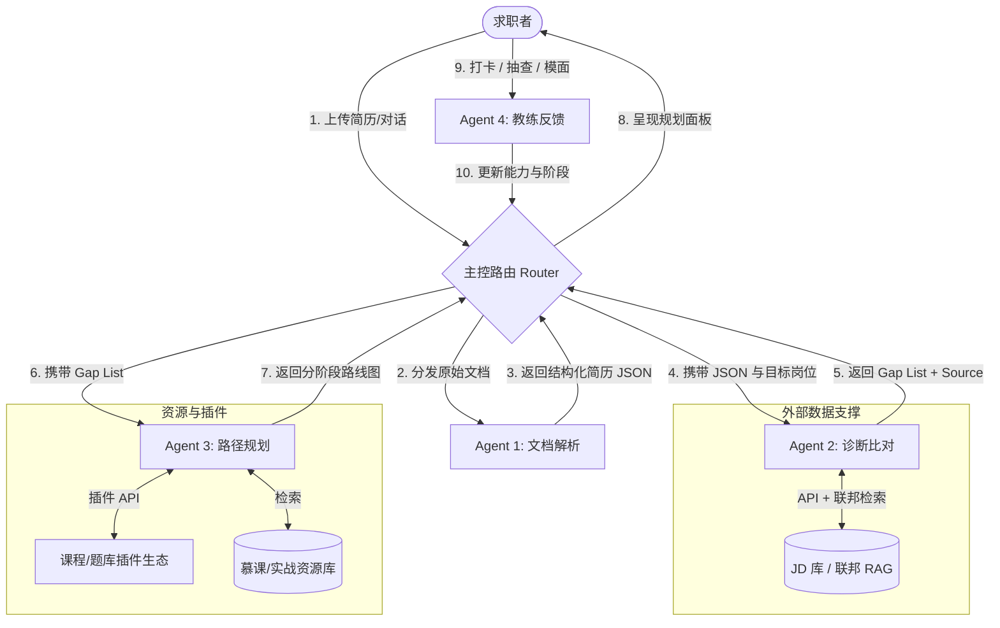
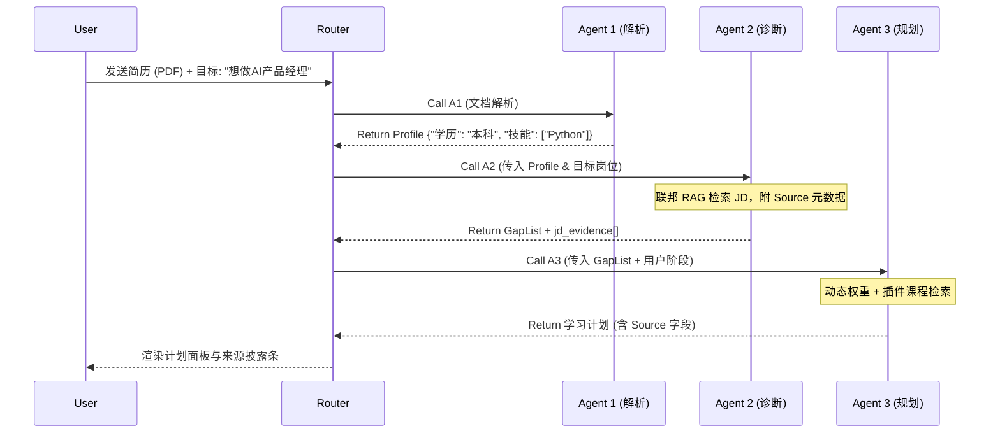
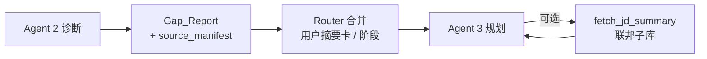
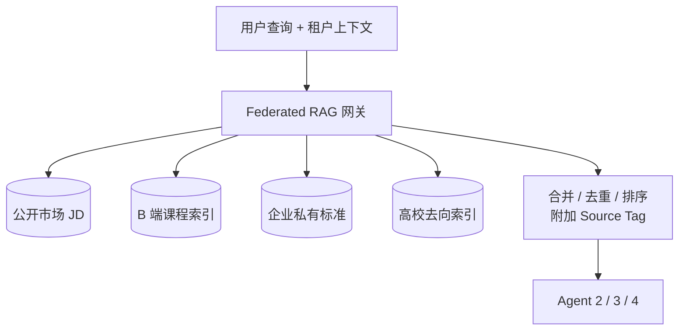
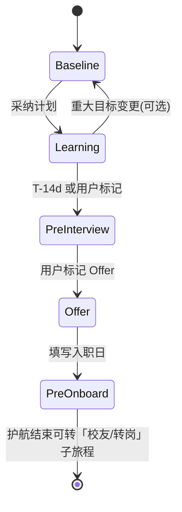

# 📄 PRD：CareerCopilot AI 核心智能体引擎设计（AI 产品经理求职 Agent）

> 多 Agent 协同职场领航员：简历解析 → 诊断比对 → 路径规划 → 教练反馈 → **守护者全周期运营** → **B2B2C 平台化**。

**文档版本：** v2.0  
**变更摘要：** 增补数据治理与来源披露、动态推荐与防依赖、守护者时间轴生命周期、Epic 4 开放平台；架构层补充插件系统与联邦 RAG。

## 目录

- [一、业务背景、目标与竞品分析](#anchor-1)
- [二、产品范围与敏捷史诗（Epic / User Story 地图）](#anchor-2-epic)
- [三、术语表与模型选型](#anchor-2)
- [四、多智能体架构与工作流设计](#anchor-3)
  - [4.1 Agent 角色定义与能力清单](#anchor-3-1)
  - [4.2 MAS 协同工作流（流程图）](#anchor-3-2)
  - [4.3 Agent 间交互时序图](#anchor-3-3)
  - [4.4 Agent2→Agent3 上下文压缩与管理策略](#anchor-3-4)
  - [4.5 平台化底层设计：插件系统与联邦 RAG](#anchor-3-5)
- [五、数据安全与合规性设计（Data Governance）](#anchor-governance)
- [六、动态推荐策略与防依赖机制](#anchor-reco-anti)
- [七、全生命周期管理：守护者计划（User Journey Lifecycle）](#anchor-guardian)
- [八、Prompt 设计与工具调用规范](#anchor-4)
- [九、非功能需求（Non-Functional Requirements）](#anchor-5)
- [十、产品评估体系与迭代闭环（Evaluation System）](#anchor-6)

---

<a id="anchor-1"></a>

## 一、业务背景、目标与竞品分析

- **业务背景：** 职场环境快速变化，求职者（特别是应届生和转行者）面临「不知道缺什么」「不知道怎么补」的痛点。传统招聘平台仅提供搜索撮合，缺乏成长陪伴。
- **产品目标：** 打造一个多 Agent 协同的职场领航员。不仅能解析用户现状，还能生成具备强实操性的学习路径，最终实现精准的岗位投递闭环；并通过 **守护者计划** 拉长 LTV，通过 **B2B2C 生态** 突破纯工具收入天花板。
- **竞品借鉴：**
  - *Careerflow（海外）*：借鉴其流程追踪（看板）功能，在其基础上增加「主动规划」与「阶段化护航」能力。
  - *通义/文心等通用大模型*：解决其「假大空」的规划问题，通过 RAG 挂载实时 JD 库，确保规划的「落地性」和「时效性」；v2.0 强制 **来源可审计**，降低合规与信任风险。

---

<a id="anchor-2-epic"></a>

## 二、产品范围与敏捷史诗（Epic / User Story 地图）

### 2.1 史诗总览

| Epic ID | 史诗名称 | 业务价值 | 优先级 |
| :--- | :--- | :--- | :--- |
| **Epic 1** | 核心智能体引擎与诊断-规划闭环 | 可演示的端到端 MVP：解析 → 诊断 → 学习路径 | P0 |
| **Epic 2** | 教练反馈与质量评测闭环 | 练习、模面、Golden Set 与 Bad Case 迭代 | P0 |
| **Epic 3** | 数据治理、动态推荐与守护者运营 | 合规可卖、推荐可信、留存与复访 | P1 |
| **Epic 4** | 开放平台与生态合作（B2B2C 平台化） | 突破 To C 工具商业化天花板 | P1 |

### 2.2 Epic 1 — User Story（摘）

- **US-1.1** 作为求职者，上传 PDF/Word 简历后，我能在 3 秒内看到结构化档案预览，以便确认解析正确。
- **US-1.2** 作为求职者，我选择目标岗位后，我能看到基于 **可追溯 JD 来源** 的技能缺口分析。
- **US-1.3** 作为求职者，我能获得分阶段学习计划，且每条推荐资源带 **Source 标签**。

### 2.3 Epic 2 — User Story（摘）

- **US-2.1** 作为求职者，我能在学习计划中完成打卡与知识点抽查，以验证掌握度。
- **US-2.2** 作为产品/算法，我能用 Golden Set 批量回归 Agent 输出，以监控 F1、幻觉率、采纳率。

### 2.4 Epic 3 — User Story（摘）

- **US-3.1** 作为用户，我能在推荐卡片上看到岗位/题库的 **数据来源与失效状态**，以便自主判断可信度。
- **US-3.2** 作为用户，我进入「面试前 2 周」阶段时，系统自动提高 **高频题与模面** 权重。

### 2.5 Epic 4：开放平台与生态合作（B2B2C 平台化）

**史诗描述：** 在统一 Agent 内核之上，通过 **插件化课程图谱接入**、**企业私有选人标准**、**高校贴牌与校内数据联邦**，形成可分润、可定制的生态层。

| Story ID | User Story | 验收要点（AC 摘要） |
| :--- | :--- | :--- |
| **US-4.1** | 作为 **B 端培训机构**，我希望接入课程图谱，使 Agent 按用户缺口推荐我的课程，并按 **CPS/CPC** 结算。 | 提供标准 `CourseProvider` 插件接口；推荐卡片展示 **机构名 + Source**；订单/点击回传可审计；合同内费率配置化。 |
| **US-4.2** | 作为 **企业 HR / 猎头**，我希望创建企业专属面试 Agent，设定 **私有选人标准**，并由 Agent 自动筛选 **高意愿候选人**。 | 企业维度隔离（租户）；标准库 + 私有 JD/胜任力模型 **联邦检索**；候选人侧授权与撤回；筛选解释字段可导出（合规范围内）。 |
| **US-4.3** | 作为 **高校就业办**，我希望使用贴牌 Agent，并 **导入同校历届学长去向** 供学生内部参考。 | 校内数据单独命名空间；仅对本校身份用户可见；与公开市场 JD **逻辑隔离**；隐私影响评估（DPIA）模板内置。 |

---

<a id="anchor-2"></a>

## 三、术语表与模型选型（Glossary & Model）

| 术语 | 说明 |
| :--- | :--- |
| **MAS（Multi-Agent System）** | 多智能体系统，通过 Router（路由）分发任务给不同专长的小 Agent。 |
| **RAG（Retrieval-Augmented Generation）** | 检索增强生成；本项目用于挂载「实时招聘岗位 JD 数据库」「行业专家知识库」及 **联邦知识子库**（企业/高校）。 |
| **Golden Set（黄金测试集）** | 由资深 HR 标注的 200 份「标准简历–目标岗位–标准学习路径」测试数据，用于评估 Agent 输出质量。 |
| **Source Tag（来源标签）** | 对外展示与日志审计用的结构化字段，如 `source_type`、`source_name`、`source_url`、`captured_at`。 |
| **Federated RAG** | 多租户/多数据域的检索编排：统一查询协议，结果按策略合并、脱敏与排序。 |

**模型选型策略（大小模型协同）：**

- **复杂推理与规划（路径规划 Agent）：** 调用大参数旗舰模型（如 Gemini Pro 级别 / GPT-4o 级别）。
- **单一任务与信息提取（文档解析 Agent）：** 调用高并发、低延迟的快模型（如 Gemini Flash 级别 / 闭源小模型）。
- **诊断比对（Agent 2）：** 默认 **中号模型 + 强工具约束**；当触发「高 stakes 决策」（门槛劝退、薪资错配预警）时，可 **路由升级** 至旗舰模型（Router 策略可配置）。

---

<a id="anchor-3"></a>

## 四、多智能体架构与工作流设计（Workflow Design）

本系统采用 **Supervisor（主控路由）+ 4 个 Worker Agents（专家智能体）** 的协同架构；平台化能力由 **插件系统** 与 **联邦 RAG** 承载（见 4.5）。

<a id="anchor-3-1"></a>

### 4.1 Agent 角色定义与能力清单

| 智能体名称 | 核心角色（Role） | 依赖信息（Inputs） | 能力与工具（Capabilities & Tools） | 输出产物（Outputs） |
| :--- | :--- | :--- | :--- | :--- |
| **Agent 1：文档解析 Agent** | 结构化数据提取专家 | 用户上传的 PDF/Word 简历、多轮对话聊天记录 | `Tool: OCR_Reader`（文字识别）<br>`Tool: Info_Extractor`（实体抽取） | 标准化 `User_Profile_JSON` |
| **Agent 2：诊断比对 Agent** | 技能缺口分析师 | Agent 1 的 JSON、用户设定的目标岗位、**动态推荐上下文**（薪资档、准备周期） | `Tool: RAG_Search`（检索最新 JD，**含来源元数据**）<br>`Tool: Diff_Analyzer`（对比差距）<br>`Tool: Job_Freshness_Filter`（失效岗位过滤） | `Gap_List` + **每条证据绑定 `jd_id` 与 Source** |
| **Agent 3：路径规划 Agent** | 资深职业规划导师 | Agent 2 的缺口清单、用户预期学习时间、**日历阶段**（守护者状态机） | `Tool: Course_DB_Query`（含 **插件课程源**）<br>`Tool: Quiz_Item_DB`（题库，带来源） | 结构化、分阶段学习计划表（**每条资源含 Source**） |
| **Agent 4：教练反馈 Agent** | 面试官与进度督导 | 打卡记录、测验结果、Agent 3 的计划、**防依赖策略参数** | `Tool: Quiz_Generator`（生成测试题）<br>`Tool: Mock_Interviewer`（语音对练） | 能力评分更新、阶段闸门（是否进入投递/模面强化周） |

<a id="anchor-3-2"></a>

### 4.2 MAS 协同工作流（Mermaid 流程图）



<a id="anchor-3-3"></a>

### 4.3 Agent 间交互时序图（Mermaid）



<a id="anchor-3-4"></a>

### 4.4 Agent2→Agent3 上下文压缩与管理策略（PM 侧要求）

**问题：** 若将完整简历 JSON、多轮对话、多份 JD 原文、中间推理过程一并传给 Agent 3，易导致 Token 成本高、延迟大，以及长上下文下的遗忘与漂移。

**产品/工程可落地的策略：**

| 策略 | 说明 | PM 关注点 |
| :--- | :--- | :--- |
| **结构化握手协议（Handoff Schema）** | Agent 2 输出 `Gap_Report`：`target_role`、`must_have_gaps`、`nice_to_have`、`evidence_jd_ids`、`confidence`、`source_manifest[]`。 | Schema 版本化；与 **来源披露** 字段对齐。 |
| **引用式上下文（Pointer / ID）** | 传递 `jd_id` / `chunk_id`；Agent 3 通过 `fetch_jd_summary(id)` 按需拉取。 | 日志保留 `source_name` 便于客诉追溯。 |
| **摘要与分级（Tiered Context）** | Router 维护「用户摘要卡」+ **守护者当前阶段**。 | 阶段切换时注入不同的默认工具策略（见第七节）。 |
| **Top-K 与裁剪规则** | 缺口技能 Top N 进入规划；其余异步生成。 | 与 **动态推荐权重** 联动（见第六节）。 |
| **状态外置（Session State）** | `session_state` 含阶段、计划版本、防依赖开关。 | 降低多轮重复计费。 |
| **评测门禁** | 对比全量 vs 压缩方案的质量跌幅上限。 | 与第十节指标挂钩。 |

**Handoff 数据流（补充流程图）：**



<a id="anchor-3-5"></a>

### 4.5 平台化底层设计：插件系统（Plugin System）与联邦 RAG（Federated RAG）

| 模块 | 设计要点 | 与 Epic 的映射 |
| :--- | :--- | :--- |
| **Plugin System** | 定义 `CourseProvider`、`AssessmentProvider`、`EnterprisePolicyProvider` 等扩展点；插件 manifest 含 **结算模式（CPS/CPC）**、回调 URL、可用地域与类目；Router 按租户与用户阶段装载插件白名单。 | Epic 4 US-4.1、US-4.2 |
| **Federated RAG** | 统一 `retrieve(query, scopes[])`：`public_jd`、`partner_courses`、`enterprise_private`、`university_cohort`；**结果级**脱敏与 **来源强制注入**；企业/高校子库 **物理或逻辑隔离**，检索审计日志独立留存。 | Epic 4 US-4.2、US-4.3；第五节合规 |

**联邦检索合并示意（Mermaid）：**



---

<a id="anchor-governance"></a>

## 五、数据安全与合规性设计（Data Governance）

### 5.1 原则与范围

- **最小必要：** 仅收集与求职护航相关的数据；默认关闭非必要画像字段。
- **可审计：** 所有对外推荐与诊断结论，具备 **可追溯来源链**（JD、题库、课程）。
- **租户隔离：** B 端企业标准、高校去向库与 C 端公共库 **默认不可见交叉**；跨域调用须 **双重授权**（平台 + 用户）。

### 5.2 来源披露（强制）

**规定：** 所有 **岗位推荐**、**题库/练习推荐**、**课程推荐** 必须在 UI 与导出报告中展示结构化来源，至少包含：

`Source: <平台或仓库名>` · `Source URL（若合同允许）` · `抓取/更新时间`

**示例（展示文案规范）：**

- 岗位卡片脚注：`*岗位来源: Boss直聘 · 抓取时间: 2026-04-10 · JD_ID: xxx*`
- 题库：`题库来源: GitHub Awesome-AI-PM（commit: abc123）`
- 课程（插件）：`*课程来源: 某某教育（CPS）· 插件 Provider ID: edu_xxx*`

**日志侧：** 同步写入 `source_manifest` JSON，供监管协查与内部质检。

### 5.3 PII 与模型调用

- 简历进入推理链路前 **必须 PII 掩码**（姓名、电话、邮箱、住址等）；B 端导出候选人解释报告时 **二次脱敏**。
- **企业/高校私有库**：默认不向公网模型发送可识别个人信息；必要时采用 **私有化部署或专用 VPC**（商务方案另附技术附录）。

### 5.4 授权、留存与删除

- **候选人侧：** 投递/被筛选场景需 **明确同意** 企业 Agent 访问范围；支持撤回与删除请求（在法规与合同允许范围内）。
- **留存周期：** 原始简历、模面录音、审计日志分类型留存策略（如简历 12 个月可配置），到期自动清理或匿名化。

---

<a id="anchor-reco-anti"></a>

## 六、动态推荐策略与防依赖机制

### 6.1 多因子动态推荐算法（产品规则）

在检索候选集（岗位 / 课程 / 题）后，进入 **重排序层**；核心因子与权重示例如下（具体参数由实验标定，可 A/B）：

| 因子 | 输入信号 | 规则方向 |
| :--- | :--- | :--- |
| **岗位截止日期** | `deadline_days`（距截止天数） | 已过期 **硬过滤**；临近截止（如 ≤7 天）**降权** unless 用户标记「急投」；长窗口岗位 **适度提权** 以稳定学习计划。 |
| **用户期待薪资** | `expected_salary_band` vs JD 区间 | 严重错配 **降权或标注预警**（不隐藏，但 UI 提示「薪资区间偏离」）。 |
| **面试准备时间** | 用户填写的「距离目标面试周数」或守护者阶段推断 | **短准备期** → 提高「高频考点题库、模面、短平快项目」权重；**长准备期** → 提高「体系课、深度项目」权重。 |

**综合得分（示意）：**  
`score = w_m * match_score + w_f * freshness(deadline) + w_s * salary_fit + w_p * prep_fit − penalty_expired`

其中 `penalty_expired` 对失效岗位为 **无穷大（剔除）**。

### 6.2 失效岗位过滤

- **数据源层：** 标记 `status=closed` 或超过平台定义 **最大静默天数** 的 JD 不再进入召回。
- **Agent 2：** 工具 `Job_Freshness_Filter` 在出用户可见列表前执行；若全部被过滤，触发 **降级提示**（与第九节高可用一致）并引导用户调整城市/职类。

### 6.3 防依赖机制（学习阶段）

| 机制 | 说明 |
| :--- | :--- |
| **先测后释** | 知识点抽查默认 **用户先提交要点/选项**，系统再展示参考答案与 AI 详解。 |
| **生成边界** | Agent 4 对「整卷代答」「面试逐字稿代写」请求 **拒绝或改写为框架提示**，并记录一次 **依赖风险评分**。 |
| **掌握度闸门** | 连续多次抽查未达标，**阻塞**「终极简历生成」或「高频题全开」等高级能力，直至补学完成。 |
| **人机混合复盘** | 每周强制 1 次「无 AI 草稿」自述录音/要点，Agent 仅做结构化点评，强化 **可迁移能力**。 |

---

<a id="anchor-guardian"></a>

## 七、全生命周期管理：守护者计划（User Journey Lifecycle）

将 Agent 服务建模为 **时间轴状态机**（由 Router `guardian_phase` 驱动），解决「一次性规划后流失」与「复用率低」问题。

### 7.1 阶段定义与交付物

| 阶段 | 触发条件（示例） | 核心交付与 Agent 行为 |
| :--- | :--- | :--- |
| **评测初期** | 新用户完成首份简历上传与目标岗确认 | 输出 **Baseline 简历**（改版后 v1）：结构优化、量化成果建议、与目标岗关键词对齐；附 **缺口诊断** 与来源披露。 |
| **学习阶段** | 用户确认学习计划并开启日历 | **按日历推送**学习内容；**知识点抽查** + 防依赖策略（第六节）；Agent 4 主导进度与评分。 |
| **面试前 2 周** | 用户填写预计面试日期或系统自动推断 | 生成 **第二版终极简历**（v2，融合学习成果与项目增量）；推送 **目标公司/岗位簇高频面试题库**（带来源）；**语音模拟面试** 频次默认提升。 |
| **Offer 阶段** | 用户标记「已获 Offer」 | 推送 **薪资谈判要点**、**背调注意事项**、入职材料清单（合规提示，非法律意见）。 |
| **入职前期** | 用户填写入职日期 | 推送 **软技能护航**：如何快速理解业务架构、干系人地图、试用期预期管理（轻量内容 + 可勾选深度课）。 |

### 7.2 阶段流转（Mermaid）



### 7.3 与推荐的联动

- `guardian_phase` 作为 Router 默认注入字段，影响 **第六节权重** 与 **Agent 3/4 工具白名单**（例如 PreInterview 周默认打开「公司题库插件」）。

---

<a id="anchor-4"></a>

## 八、Prompt 设计与工具调用规范

以 **Agent 2（诊断比对 Agent）** 为例，展示 Prompt 框架设计（v2.0 增补来源与失效约束）：

```text
# 系统提示词 (System Prompt): Agent 2 诊断比对专家

<Role>
你是一位拥有 10 年经验的资深猎头与能力评估专家。你的任务是精准客观地评估候选人现状与目标岗位的差距。
</Role>

<Workflow>
1. 接收来自上游的候选人能力 JSON (`user_profile`)。
2. 接收候选人的目标岗位意向 (`target_role`) 与动态上下文（期待薪资档、准备周期、守护者阶段）。
3. 调用工具 `search_realtime_jd(role="target_role")` 获取市场上最新的高质量 JD；仅保留通过 `Job_Freshness_Filter` 的记录。
4. 对比 `user_profile` 和 JD 要求，严格归类为：【已匹配技能】、【需重点补齐技能】、【加分项技能】。
5. 对每条关键结论，绑定 `jd_id` 与 `source`（如 source_name="Boss直聘"）。
</Workflow>

<Constraints>
- 客观严谨：严禁自行捏造岗位要求（Hallucination），必须基于工具召回的 JD 数据。
- 颗粒度细：不要输出“缺乏编程能力”，而是输出“缺乏 Python 数据分析（Pandas/Numpy）能力”。
- 来源披露：输出 JSON 中必须包含 `source_manifest` 数组，列出引用到的 JD 来源与抓取时间。
- 语气：专业、直接，具有建设性。
</Constraints>

<OutputFormat>
必须严格按照以下 JSON 格式输出，不要包含多余的 markdown 符号或解释文本：
{
  "match_score": 65,
  "matched_skills": ["Python", "沟通能力"],
  "gap_skills": [
    {"skill": "RAG原理", "urgency": "High", "evidence_jd_ids": ["jd_001"]}
  ],
  "source_manifest": [
    {"jd_id": "jd_001", "source_name": "Boss直聘", "captured_at": "2026-04-10"}
  ]
}
</OutputFormat>
```

**Agent 3 补充约束（摘要）：** 每条 `learning_item` 必含 `source_name`、`source_url`（若可用）、`provider_type`（自营/插件）；禁止编造未在工具返回中的 URL。

---

<a id="anchor-5"></a>

## 九、非功能需求（Non-Functional Requirements）

1. **性能指标（Performance）**
   - Agent 1 解析简历并返回 JSON：**&lt; 3 秒**。
   - 全链路（从解析到生成完整学习路径）：**&lt; 12 秒**（联邦检索扩容目标 **&lt; 15 秒** P95）。UI 使用流式输出（Streaming）或骨架屏缓解等待焦虑。

2. **数据安全与隐私（Security）**  
   - 与 **第五节** 一致：PII 掩码、租户隔离、审计日志。

3. **高可用性（Availability）**
   - 外部 JD 数据库 API 熔断时，自动降级，使用 **许可范围内** 的本地/缓存 JD 摘要库；**UI 必须标注「非实时数据源」** 并降低 match 置信度展示。

4. **生态与结算（Epic 4）**
   - 插件回调 **幂等键**、对账文件日切；企业租户 **QPS 与数据导出** 按合同限流。

---

<a id="anchor-6"></a>

## 十、产品评估体系与迭代闭环（Evaluation System）

### 10.1 评测指标设计（Metrics）

- **业务指标：** 计划完成率（Completion Rate）、岗位直推投递率、用户留存率、**守护者阶段转化率**、**插件 CTR/CPS 收入**（Epic 4）。
- **模型指标：**
  - *实体抽取准确率（F1）：* 评估 Agent 1。
  - *幻觉率（Hallucination Rate）：* 死链或不存在资源占比（需 **&lt; 2%**）；**来源缺失率**（UI 无 Source 占比）需 **&lt; 0.5%**（P0 质量线）。
  - *采纳率（Acceptance Rate）：* 专家评估学习计划合理性。
  - *防依赖指标：* **先测后释完成率**、**代答拦截率**、抽查通过率 vs 模面评分相关性。

### 10.2 Golden Set（黄金测试集）

建立包含 **200** 个 Case 的测试集：

- **Normal Case：** 正常本科生跨行求职。
- **Corner Case：** 经历断层、技能极端偏科、目标极其不现实（如：应届文科生想直接面大厂算法架构师）。
- **v2.0 增补：** **过期 JD / 薪资错配 / 短准备期** 三类注入 Case，用于回归动态推荐与过滤逻辑。

### 10.3 Bad Case 归因与迭代闭环

| 发现阶段 | Bad Case 表现 | 根因分类（Root Cause） | 解决与迭代手段（Solution） |
| :--- | :--- | :--- | :--- |
| **评测/客诉** | 推荐的学习资源链接打不开，或书名不存在。 | Agent 3 知识幻觉（Hallucination）。 | 强制工具库校验 URL；模型原样输出；**缺失 Source 不允许上架展示**。 |
| **评测/客诉** | 用户学历大专，目标大厂算法岗，仍生成「一本正经」的计划。 | Agent 2 逻辑缺陷（未做门槛硬性阻断）。 | Prompt 增加 `<Constraints: 门槛校验>`；触发劝退或目标调整节点。 |
| **合规** | 用户投诉「不知道岗位从哪来」。 | 来源披露缺失或日志不全。 | 第五节规范落地；抽检 `source_manifest` 与 UI 一致性。 |
| **留存** | 学完即走，不复访。 | 缺少阶段化交付物。 | 强化守护者计划闸门与通知策略；A/B 各阶段触达文案。 |

---

*文档版本：v2.0 | 结构：目录锚点 + Mermaid 架构/时序/联邦检索/守护者状态机；敏捷史诗 Epics 1–4 与用户故事对齐。*
